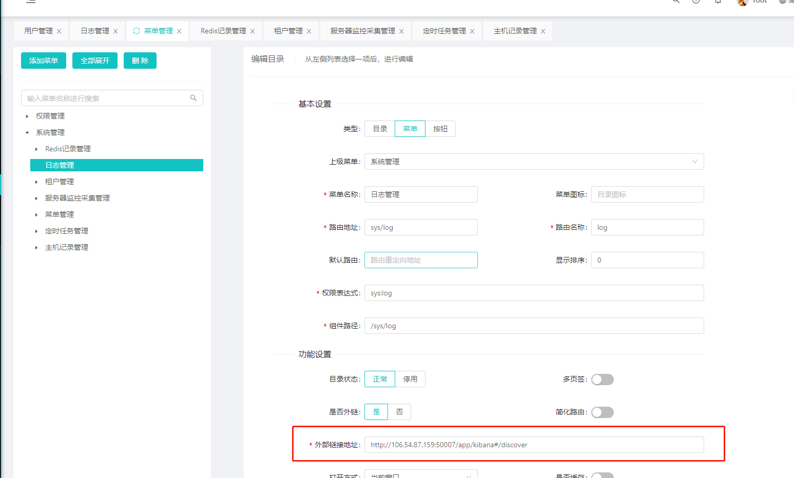

# 如何配置外链

这个非常的简单，只需要两步，


## 第一步

在菜单管理里面配置好外链地址




## 第二步

在router.map.js加入如下代码

```js
 log:{
    component : ()=>import("@/components/iframe/Iframe"),
    props : {
      src : "http://106.54.87.159:50007/app/kibana#/discover",
    }
  }
```

